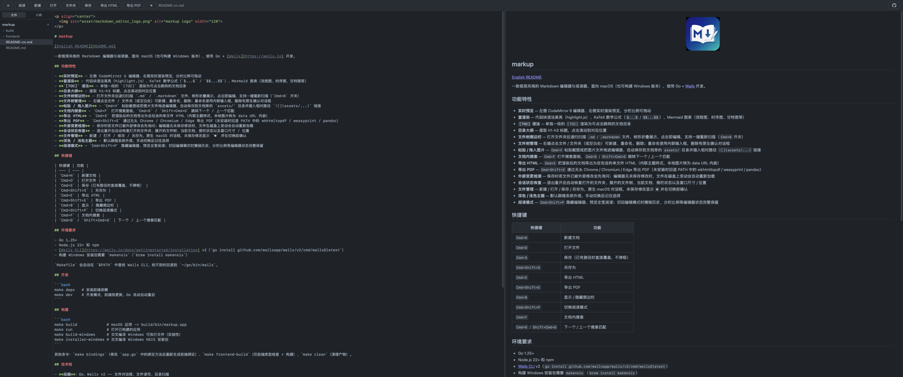

<p align="center">
  
</p>

# markup

[English README](README.md)

一款极简风格的 Markdown 编辑器与阅读器，面向 macOS（也可构建 Windows 版本），使用 Go + [Wails](https://wails.io) 开发。



## 功能特性

- **实时预览** — 左侧 CodeMirror 6 编辑器、右侧实时渲染预览，分栏比例可拖动
- **富渲染** — 代码块语法高亮（highlight.js）、KaTeX 数学公式（`$...$` / `$$...$$`）、Mermaid 图表（流程图、时序图、甘特图等）
- **`[TOC]` 语法** — 单独一段的 `[TOC]` 渲染为可点击跳转的文档目录
- **目录大纲** — 提取 h1–h3 标题，点击滚动到对应位置
- **文件树侧边栏** — 打开文件夹后递归扫描 `.md` / `.markdown` 文件，树形折叠展示，点击即编辑，支持一键重新扫描（`Cmd+B` 开关）
- **文件树管理** — 右键点击文件 / 文件夹（或空白处）可新建、重命名、删除；重命名使用内联输入框，删除有原生确认对话框
- **粘贴 / 拖入图片** — `Cmd+V` 粘贴截图或把图片文件拖进编辑器，自动保存到文档旁的 `assets/` 目录并插入相对路径 `` 链接
- **文档内搜索** — `Cmd+F` 打开搜索面板，`Cmd+G` / `Shift+Cmd+G` 跳转下一个 / 上一个匹配
- **导出 HTML** — `Cmd+E` 把渲染后的文档导出为自包含的单文件 HTML（内联主题样式，本地图片转为 data URL 内嵌）
- **导出 PDF** — `Cmd+Shift+E` 通过无头 Chrome / Chromium / Edge 导出 PDF（未安装时回退 PATH 中的 wkhtmltopdf / weasyprint / pandoc）
- **外部变更检测** — 保存时若文件已被外部修改会先询问；编辑器无未保存修改时，文件在磁盘上变动会自动重新加载
- **会话状态恢复** — 退出重开后自动恢复打开的文件夹、展开的文件树、当前文档、侧栏状态以及窗口尺寸 / 位置
- **最近打开列表** — 关闭文件（`Cmd+W`）后在编辑区显示欢迎面板，列出最近使用的 10 个文件和文件夹，点击即打开，悬停可移除单条
- **文件管理** — 新建 / 打开 / 保存 / 另存为，原生 macOS 对话框，未保存修改显示 `●` 并在切换前确认
- **深色 / 浅色主题** — 默认跟随系统外观，手动切换后记住选择
- **阅读模式** — `Cmd+Shift+P` 隐藏编辑器、预览全宽阅读；切回编辑模式时撤销历史、分栏比例等编辑器状态完整保留

## 快捷键

| 快捷键 | 功能 |
| --- | --- |
| `Cmd+N` | 新建文档 |
| `Cmd+O` | 打开文件 |
| `Cmd+W` | 关闭当前文件 |
| `Cmd+S` | 保存（已有路径时直接覆盖，不弹框） |
| `Cmd+Shift+S` | 另存为 |
| `Cmd+E` | 导出 HTML |
| `Cmd+Shift+E` | 导出 PDF |
| `Cmd+B` | 显示 / 隐藏侧边栏 |
| `Cmd+Shift+P` | 切换阅读模式 |
| `Cmd+F` | 文档内搜索 |
| `Cmd+G` / `Shift+Cmd+G` | 下一个 / 上一个搜索匹配 |

## 环境要求

- Go 1.25+
- Node.js 22+ 和 npm
- [Wails CLI](https://wails.io/docs/gettingstarted/installation) v2（`go install github.com/wailsapp/wails/v2/cmd/wails@latest`）
- 构建 Windows 安装包需要 `makensis`（`brew install makensis`）

`Makefile` 会自动在 `$PATH` 中查找 Wails CLI，找不到时回退到 `~/go/bin/wails`。

## 开发

```bash
make deps   # 安装前端依赖
make dev    # 开发模式，前端热更新，Go 改动自动重启
```

## 构建

```bash
make build             # macOS 应用 -> build/bin/markup.app
make run               # 打开已构建的应用
make build-windows     # 交叉编译 Windows 可执行文件（实验性）
make installer-windows # 交叉编译 Windows NSIS 安装包
```

其他命令：`make bindings`（修改 `app.go` 中的绑定方法后重新生成前端绑定）、`make frontend-build`（仅前端类型检查 + 构建）、`make clean`（清理产物）。

## 技术栈

- **后端**：Go、Wails v2 —— 文件对话框、文件读写、目录扫描
- **前端**：Vue 3 + TypeScript + Vite
- **编辑器**：CodeMirror 6
- **渲染**：markdown-it、highlight.js、KaTeX、Mermaid

## 项目结构

```
main.go, app.go      Wails 入口与后端绑定方法（Go）
frontend/src/        Vue 应用：App.vue（界面）、markdown.ts（渲染管线）、theme.ts（主题）
wails.json           Wails 项目配置
Makefile             开发 / 构建 / 安装包任务
```

## 说明

- 导出 PDF 需要机器上有转换工具：Chrome / Chromium / Edge（以无头模式调用）或 `PATH` 中的 `wkhtmltopdf` / `weasyprint` / `pandoc`。都没有时请先导出 HTML，再用浏览器打印为 PDF。
- 从 macOS 交叉编译 Windows 版本属于实验性功能；正式发布建议在 Windows 机器或 CI 上构建。目标机器需要 WebView2 运行时（Windows 11 及大部分 Windows 10 已预装）。
- 应用未签名，首次启动时 macOS Gatekeeper 和 Windows SmartScreen 可能提示警告。

## 开源协议

[WTFPL](LICENSE) — 你想干嘛就干嘛。
