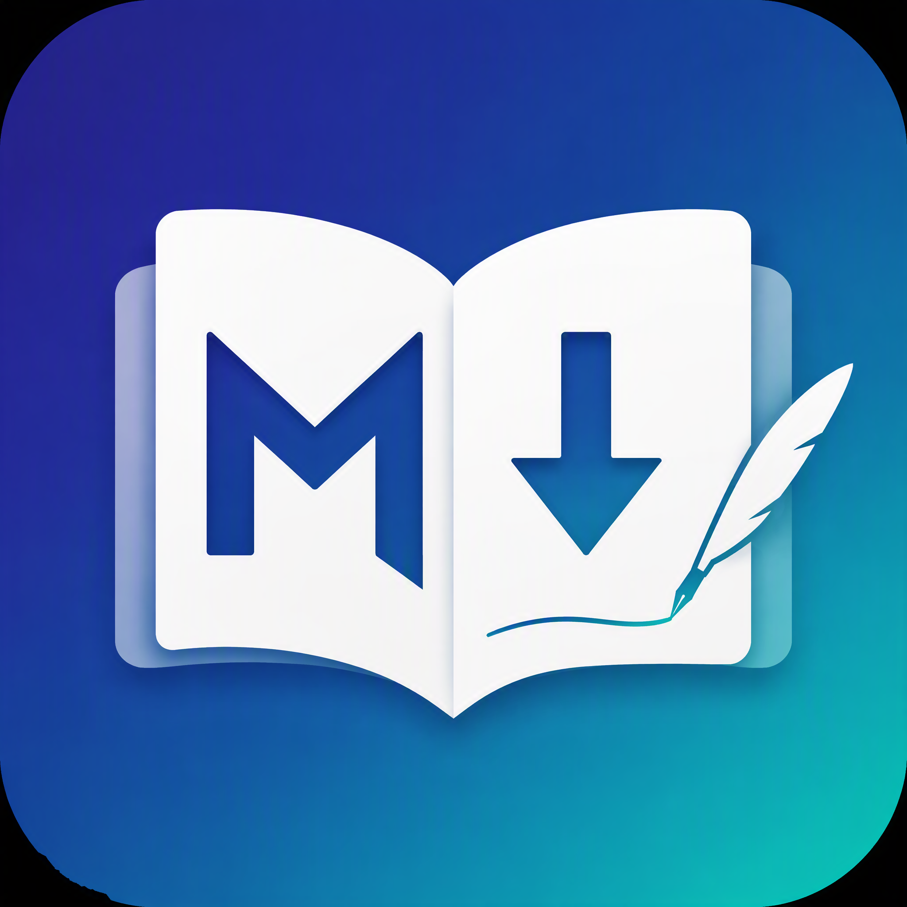

<p align="center">
  
</p>

# markup

[toc]

[中文文档](README-cn.md)

A minimalist Markdown editor and reader for macOS (Windows builds also available), built with Go + [Wails](https://wails.io).

## Features

- **Live preview** — split view with a CodeMirror 6 editor on the left and a real-time rendered preview on the right, with a draggable divider
- **Rich rendering** — syntax-highlighted code blocks (highlight.js), KaTeX math (`$...$` / `$$...$$`), Mermaid diagrams (flowcharts, sequence diagrams, gantt charts, and more)
- **`[TOC]` syntax** — a standalone `[TOC]` paragraph renders as a clickable table of contents of the document headings
- **Outline** — heading outline (h1–h3) with click-to-scroll navigation
- **File tree sidebar** — open a folder to recursively scan `.md` / `.markdown` files; collapsible tree, click to edit, one-click rescan (toggle with `Cmd+B`)
- **File tree management** — right-click files/folders (or the blank area) to create, rename, or delete entries; inline rename input, native delete confirmation
- **Paste & drop images** — paste a screenshot (`Cmd+V`) or drop an image file into the editor; it is saved to an `assets/` folder next to the document and inserted as a relative `` link
- **In-document search** — `Cmd+F` opens the search panel, `Cmd+G` / `Shift+Cmd+G` jump to the next/previous match
- **HTML export** — export the rendered document as a self-contained HTML file (theme styles inlined, local images embedded as data URLs) with `Cmd+E`
- **PDF export** — export to PDF with `Cmd+Shift+E` via headless Chrome/Chromium/Edge (falls back to wkhtmltopdf / weasyprint / pandoc if installed)
- **External change detection** — saving over an externally modified file asks first; a clean editor auto-reloads when the file changes on disk
- **Session restore** — relaunching restores the open folder, expanded tree, current document, sidebar state, and window size/position
- **File management** — new / open / save / save-as with native macOS dialogs, unsaved-changes indicator (`●`) and discard confirmation
- **Dark & light themes** — follows the system appearance by default, manual toggle persisted across launches
- **Reader mode** — hide the editor and read the preview full-width with `Cmd+Shift+P`; editor state (undo history, split ratio) is preserved when toggling back

## Keyboard Shortcuts

| Shortcut | Action |
| --- | --- |
| `Cmd+N` | New document |
| `Cmd+O` | Open file |
| `Cmd+S` | Save (silent overwrite once a path is known) |
| `Cmd+Shift+S` | Save as |
| `Cmd+E` | Export HTML |
| `Cmd+Shift+E` | Export PDF |
| `Cmd+B` | Toggle sidebar |
| `Cmd+Shift+P` | Toggle reader mode |
| `Cmd+F` | Find in document |
| `Cmd+G` / `Shift+Cmd+G` | Next / previous search match |

## Requirements

- Go 1.25+
- Node.js 22+ and npm
- [Wails CLI](https://wails.io/docs/gettingstarted/installation) v2 (`go install github.com/wailsapp/wails/v2/cmd/wails@latest`)
- For the Windows installer: `makensis` (`brew install makensis`)

The `Makefile` auto-detects the Wails CLI in `$PATH`, falling back to `~/go/bin/wails`.

## Development

```bash
make deps   # install frontend dependencies
make dev    # live development with hot reload
```

## Building

```bash
make build             # macOS app -> build/bin/markup.app
make run               # open the built app
make build-windows     # cross-compile Windows exe (experimental)
make installer-windows # cross-compile Windows NSIS installer
```

Other targets: `make bindings` (regenerate JS bindings after changing methods in `app.go`), `make frontend-build` (type-check + Vite build only), `make clean`.

## Tech Stack

- **Backend**: Go, Wails v2 — file dialogs, file I/O, folder scanning
- **Frontend**: Vue 3 + TypeScript + Vite
- **Editor**: CodeMirror 6
- **Rendering**: markdown-it, highlight.js, KaTeX, Mermaid

## Project Structure

```
main.go, app.go      Wails entry point and bound backend methods (Go)
frontend/src/        Vue app: App.vue (UI), markdown.ts (render pipeline), theme.ts (themes)
wails.json           Wails project config
Makefile             dev / build / installer tasks
```

## Notes

- PDF export needs a converter on the machine: Chrome / Chromium / Edge (used headlessly) or `wkhtmltopdf` / `weasyprint` / `pandoc` in `PATH`. Without one, export to HTML and print to PDF from a browser.
- Cross-compiling the Windows build from macOS is experimental; for releases, build on a Windows machine or a CI runner. The target machine needs the WebView2 runtime (preinstalled on Windows 11 and most Windows 10).
- The app is unsigned; macOS Gatekeeper and Windows SmartScreen may warn on first launch.

## License

[WTFPL](LICENSE) — do what the fuck you want to.
